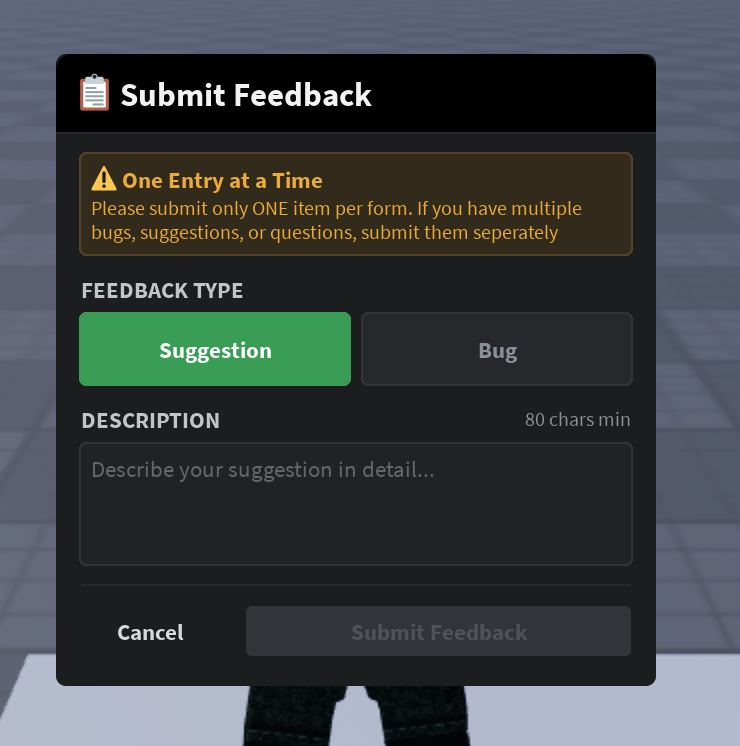
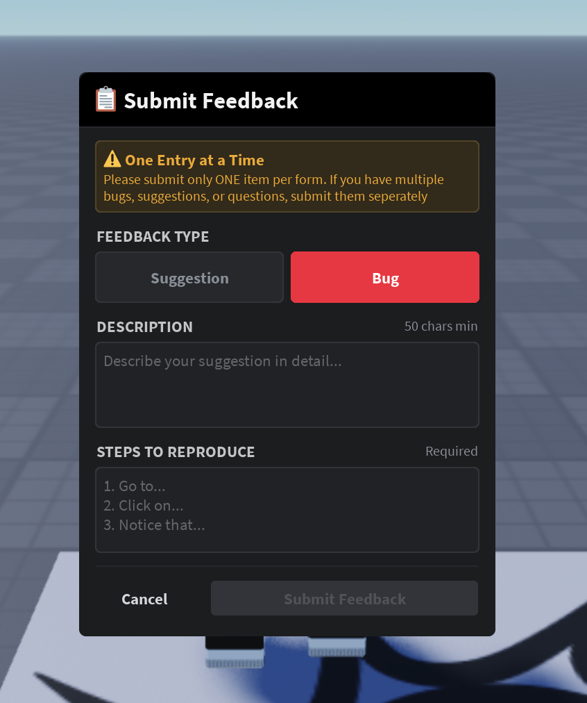

# BetaHub Roblox Feedback Widget

An in-game feedback widget for Roblox games that lets players submit bug reports and feature suggestions to the BetaHub platform.

| Suggestion Form | Bug Report Form |
|:---:|:---:|
|  |  |

## Features

- **Unified UI**: Dark-themed feedback form with Bug/Suggestion toggle
- **Bug Reports**: Description + steps to reproduce + automatic console log collection and upload
- **Feature Suggestions**: Description-based submission
- **Client-side validation**: Minimum character counts (50 for bugs, 80 for suggestions) with live feedback
- **Server-side error display**: API rejection reasons shown to the player
- **Rate limiting**: Configurable per-player cooldown
- **Secure credentials**: Uses Roblox `HttpService:GetSecret()` for API tokens

## Project Structure

```
BetaHubFeedbackWidget.rbxl          # Source of truth (full UI + scripts)

FeedbackWidget/                      # Exported scripts for readable git diffs
├── Server/
│   └── BetahubFeedbackServer.lua    # Server script (ServerScriptService)
└── Client/
    ├── FeedbackUIHandler.lua        # Main UI logic (LocalScript)
    ├── AutoTextBoxScaler.lua        # Auto-expanding text boxes (ModuleScript)
    ├── ButtonColourer.lua           # Button state styling (ModuleScript)
    └── ExampleOpenCloseButton.lua   # Example toggle button (LocalScript)
```

The `.rbxl` file contains the full widget including UI hierarchy. The `FeedbackWidget/` directory is an export of the scripts for version control readability.

## Roblox Studio Setup

1. Open `BetaHubFeedbackWidget.rbxl` in Roblox Studio
2. Copy these instances into your game:
   - `StarterGui > BetahubFeedbackUi` (the feedback form UI)
   - `StarterGui > ExampleOpenCloseButton` (example toggle button)
   - `ReplicatedStorage > BetahubFeedback` (RemoteFunction)
   - `ServerScriptService > BetahubFeedbackServer` (server script)
3. Configure secrets in Roblox Creator Dashboard (Game Settings > Security > Secrets):
   - `BH_PROJECT_ID` — your BetaHub project ID (e.g. `pr-XXXXXXXXXX`)
   - `BH_AUTH_TOKEN` — your BetaHub FormUser auth token
4. Enable **Allow HTTP Requests** in Game Settings > Security

## How It Works

### Bug Report Flow
1. Player selects "Bug", fills in description (50 chars min) and steps to reproduce
2. Client collects console logs from `LogService` (last 200 entries)
3. Server POSTs to `POST /projects/{id}/issues.json` with description, steps, source, and roblox user ID
4. Server parses response to get issue ID and JWT token
5. Server uploads console logs to `POST /projects/{id}/issues/g-{issueId}/log_files.json`

### Suggestion Flow
1. Player selects "Suggestion", fills in description (80 chars min)
2. Server POSTs to `POST /projects/{id}/feature_requests.json`

### API Integration

- **Authentication**: `FormUser` token via `Authorization` header
- **Content-Type**: `application/x-www-form-urlencoded`
- **Custom fields**: `issue[custom][roblox_id]` / `feature_request[custom][roblox_id]` for player tracking
- **Log upload auth**: `FormUser {auth_token},{jwt_token}` with JWT from issue creation response

## Configuration

Edit the top of `BetahubFeedbackServer` in Studio:

```lua
API_BASE_URL = "https://app.betahub.io"
RATE_LIMIT = 20                      -- Seconds between submissions per player
RESET_RATE_LIMIT_ON_FAILURE = false  -- Keep false to prevent spam on API errors
```

## License

Part of the BetaHub platform integration suite.